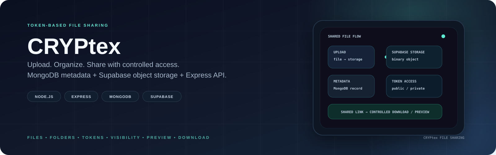
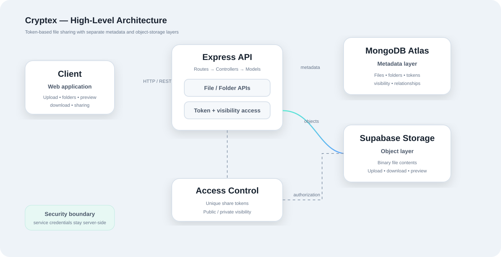

<p align="center">
  
</p>

<p align="center">Token-based file sharing with separated metadata and object storage.</p>

<p align="center"><a href="https://cryptex-file-sharing.onrender.com/">Live Demo</a></p>

# Cryptex

Cryptex is a full-stack file sharing platform built around **token-based access control**. Users can upload files, organize them into folders, preview and download content, and share resources through unique tokens without exposing database identifiers.

The system separates **file metadata** from **binary storage**: MongoDB stores application metadata while Supabase Storage holds the actual file objects. Express provides the API and enforces visibility and access rules. fileciteturn48file0L2-L2

## Architecture

<p align="center"></p>

### Request flow

1. The client sends a file or folder operation to the Express API.
2. Controllers validate the requested resource and access mode.
3. Binary content is stored in Supabase Storage.
4. MongoDB stores the corresponding metadata and relationships.
5. A unique token provides a controlled sharing path without exposing database IDs.
6. Visibility rules determine whether the resource is publicly or privately accessible.

## Core Features

### File management

- Upload and download files
- Preview supported content
- Rename and delete files
- Organize files into folders

### Folder management

- Create, rename and delete folders
- Add or remove files from folders
- Share folders through tokens

### Token-based sharing

- Unique tokens for files and folders
- Share resources without exposing database IDs
- Token-based access endpoints

### Visibility controls

- Public and private resources
- Change visibility without moving stored objects
- Server-side access checks

## Storage Model

| Concern | Technology | Responsibility |
|---|---|---|
| API | Express 5 | Routing, controllers and access logic |
| Metadata | MongoDB + Mongoose | Files, folders, tokens and relationships |
| Binary storage | Supabase Storage | Actual file contents |
| Upload handling | Multer | Multipart file processing |
| Rate limiting | express-rate-limit | Request throttling |

This separation keeps database records lightweight while delegating binary object storage to Supabase. fileciteturn51file0L2-L2

## API Surface

### Files

| Method | Endpoint | Purpose |
|---|---|---|
| POST | `/api/files/upload` | Upload a file |
| GET | `/api/files` | List files |
| GET | `/api/files/:id` | Get file metadata |
| GET | `/api/files/:id/download` | Download a file |
| GET | `/api/files/:id/preview` | Preview a file |
| PATCH | `/api/files/:id` | Rename a file |
| PATCH | `/api/files/:id/visibility` | Change visibility |
| DELETE | `/api/files/:id` | Delete a file |
| GET | `/api/files/token/:token` | Access a file through a share token |

### Folders

| Method | Endpoint | Purpose |
|---|---|---|
| POST | `/api/folders` | Create a folder |
| GET | `/api/folders` | List folders |
| GET | `/api/folders/:id` | Get folder details |
| PATCH | `/api/folders/:id` | Rename a folder |
| PATCH | `/api/folders/:id/visibility` | Change visibility |
| DELETE | `/api/folders/:id` | Delete a folder |
| POST | `/api/folders/:id/files` | Add a file to a folder |
| DELETE | `/api/folders/:id/files/:fileId` | Remove a file from a folder |
| GET | `/api/folders/token/:token` | Access a folder through a share token |

## Security Considerations

- Secrets are supplied through environment variables.
- The Supabase service-role key remains server-side.
- Share links use generated tokens instead of database IDs.
- Private resources are protected by server-side access rules.
- API rate limiting is enabled through `express-rate-limit`.

Token-based sharing is an application-level access mechanism; it should not be presented as encryption or end-to-end encryption.

## Getting Started

### Requirements

- Node.js
- MongoDB Atlas or a MongoDB deployment
- Supabase project with a Storage bucket

### Installation

```bash
git clone https://github.com/Zephyrex21/cryptex-file-sharing.git
cd cryptex-file-sharing
npm install
```

Create `.env` from these variables:

```env
MONGO_URI=
SUPABASE_URL=
SUPABASE_SERVICE_KEY=
SUPABASE_BUCKET=
PORT=3000
```

### Development

```bash
npm run dev
```

### Production

```bash
npm start
```

## Project Structure

```text
cryptex-file-sharing/
├── config/          # Database and service configuration
├── controllers/     # Request handling and application logic
├── models/          # MongoDB schemas
├── routes/          # REST API routes
├── public/          # Frontend/static assets
├── index.js         # Application entry point
├── .env.example
└── package.json
```

## Production Notes

The deployed application uses Render for the web service and Supabase Storage for file objects. The service requires MongoDB and Supabase credentials to be configured through environment variables.

## License

This project is licensed under the ISC License.

## Author

**Saurabh Raj Shekhar**

Built with Node.js, Express, MongoDB and Supabase Storage.